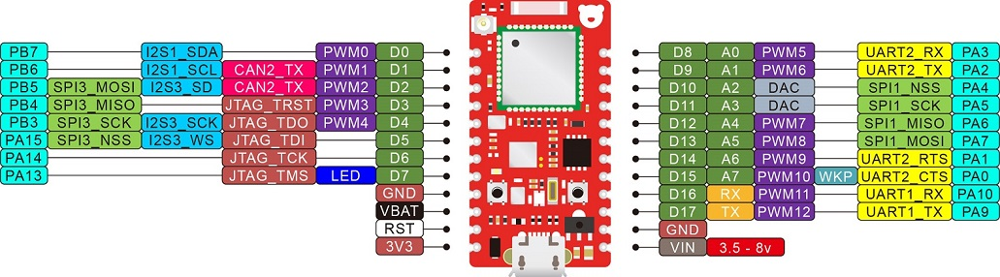
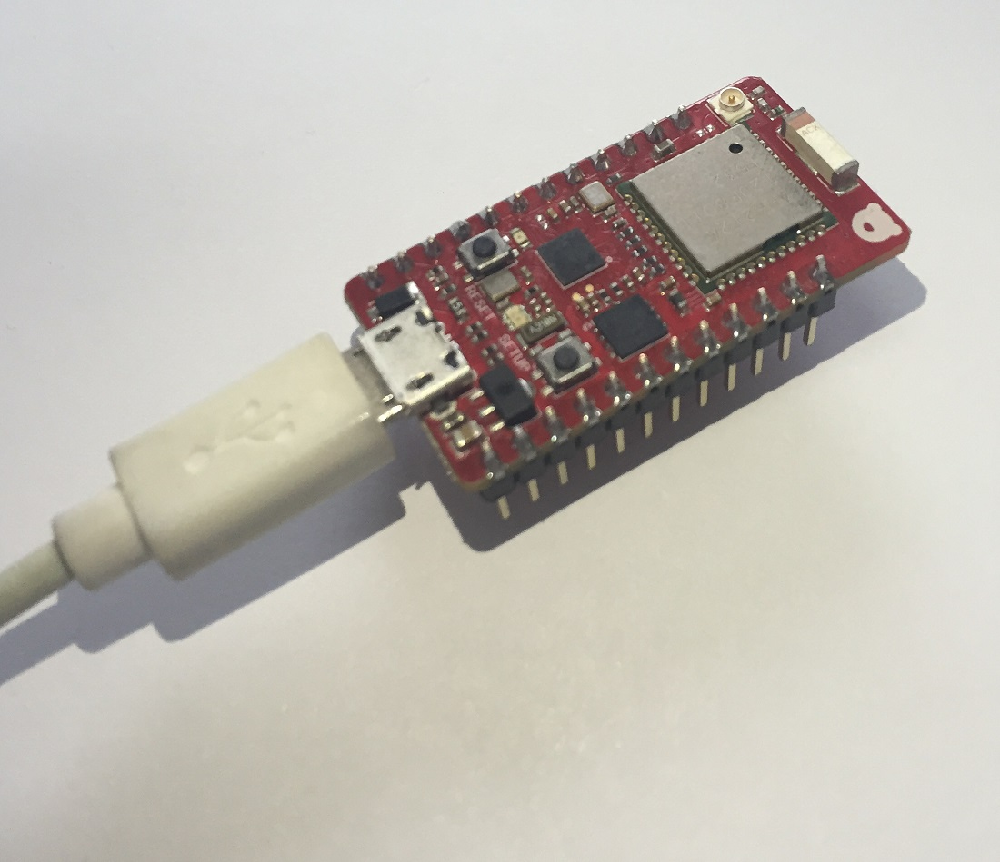
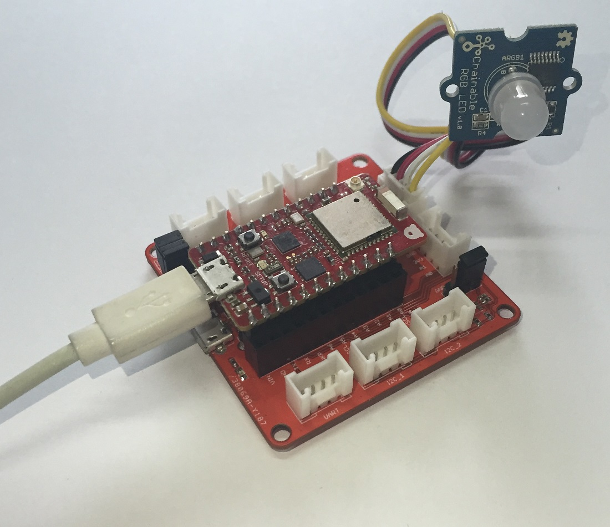

# STM32-Arduino

Allows Arduino fans to use the Arduino IDE to develop STM32 MCU firmware. Currently, it supports the RedBear Duo (STM32F205) IoT development kit.

The kit contains two boards, the RedBear Duo and the RBLink.

The Duo is a small and powerful IoT development board that has an ARM Cortex-M3 MCU runs at 120 MHz with 1 MB Flash (256 KB for Arduino sketch) and 128 KB SRAM, it comes with Broadcom's BCM43438 connectivity chip so that the Duo has WiFi (802.11n / 2.4 GHz) and Bluetooth features at the same time, the board only requires a single antenna.

The RBLink is for loading/debugging firmwares to the Duo and provides interface for Seeed Studio Grove System modules.

You do not really need the RBLink if you are not going to development firmware using Broadcom's WICED SDK.

# Requirements

1. Basic Arduino knowledge
2. RedBear Duo development board
3. Arduino IDE (1.6.7)
4. Arduino board support package (0.2.1)
5. Duo Firmware (0.2.1-beta)

# Install Driver (only for Windows)

USB CDC

Connect the Duo to your Windows PC using the USB port and install the driver from the "driver/windows" folder.

# Update Firmware

1. Connect the Duo to your PC via the USB port.

2. Continue with the page for the instructions:
	
	https://github.com/redbear/STM32-Arduino/tree/master/firmware

# Setup Arduino IDE

Step 1:

Download the Arduino IDE, tested with 1.6.7 on OSX and Windows only but Linux should also work.

https://www.arduino.cc/en/Main/Software

Step 2:

Start the IDE and from the menu, Preferences, add the following to "Additional Boards Manager URLs"

https://redbearlab.github.io/arduino/package_redbear_index.json

Step 3:

From the menu, Tools > Board, select "Boards Manager" and install the RedBear Duo board support package to the IDE.

Step 4:

Connect the Duo to your computer through the USB port of the Duo.

*** Note that, it is not the RBLink's USB port if you are going to use the RBLink for Grove System components, the following photo shows the setup (connected to Grove RGB LED):

Step 5:

From the menu, Tools > Board, select RedBear Duo under RedBear IoT Boards.

Step 6:

Select the Port under the Tools menu.

Step 7:

From the menu, File > Examples > RedBear_Duo, select the example "Duo_Blink" and upload to the board.

Step 8:

The LED on the board is blinking.

# Known Issues

1. BLE API is in progress, if you want to try, put it to the folder document/arduino/library

https://github.com/redbear/btstack/tree/duo-arduino/port/duo-arduino
