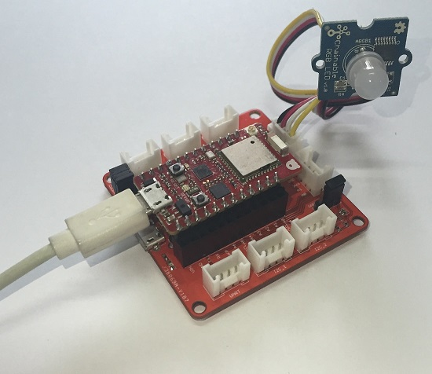

# STM32-Arduino

Allows Arduino fans to use the Arduino IDE to develop STM32 MCU firmware. Currently, it supports the RedBear Duo (STM32F205) IoT development kit.

The Duo IoT development kit contains two boards, the Duo and the RBLink.

The Duo is a small and powerful IoT development board that has an ARM Cortex-M3 MCU runs at 120 MHz with 1 MB Flash (256 KB for Arduino sketch) and 128 KB SRAM, it comes with Broadcom's BCM43438 connectivity chip so that the Duo has WiFi (802.11n / 2.4 GHz) and Bluetooth features at the same time, the board only requires a single antenna.

The RBLink provides interfaces for Seeed Studio Grove System modules.

You do not really need the RBLink if you are not going to develop firmware using Broadcom's WICED SDK.

Note: unless you want to contribute to the Duo board support package, you do need to touch the folder 'arduino' because you will use the Arduino Boards Manager to add it to the Arduino IDE. 

# Requirements

1. Basic [Arduino](http://www.arduino.cc) knowledge
2. RedBear [Duo](http://www.redbear.cc/duo) development board
3. Understand the [Duo system architecture](https://github.com/redbear/Duo)
4. Go through the Duo [Getting Started Guide](https://github.com/redbear/Duo/blob/master/docs/getting_started.md)
5. Arduino IDE (1.6.7)
6. Arduino board support package (0.2.4)
7. Duo Firmware (0.2.2)

# Install Driver (only for Windows)

USB CDC

Connect the Duo to your Windows PC using the USB port and install the driver from the "driver/windows" folder.

# Update udev Rules (only for Linux)

For Linux (e.g. Ubuntu 14.04) users: ModemManager will try to use the Duo as a modem and this causes the upload process fail using Arduino IDE. To allow Arduino IDE to upload correctly, you need to fix it by modify the UDEV rule, write a simple UDEV rule to ignore it from being handled by modem manager.

	$ sudo nano /etc/udev/rules.d/77-mm-usb-device-blacklist.rules
	
Simply add this single line:

	ATTR{idVendor}=="2b04", ENV{ID_MM_DEVICE_IGNORE}="1"

# Install lsb-core (only for Linux)

On Linux, if you cannot compile sketches (the IDE cannot find gcc or g++):

	$ sudo apt-get install lsb-core

# Update Firmware

1. Connect the Duo to your PC via the USB port.

2. Continue with [this page](https://github.com/redbear/STM32-Arduino/tree/master/firmware) for the instructions:
	
	https://github.com/redbear/STM32-Arduino/tree/master/firmware

# Setup Arduino IDE

Step 1:

Download the Arduino IDE, tested with 1.6.7 on OSX and Windows only but Linux should also work.

https://www.arduino.cc/en/Main/Software

Step 2:

Start the IDE and from the menu, Preferences, add the following to "Additional Boards Manager URLs"

https://redbearlab.github.io/arduino/package_redbear_index.json

Step 3:

From the menu, Tools > Board, select "Boards Manager" and install the RedBear Duo board support package to the IDE.

Step 4:

Connect the Duo to your computer through the USB port of the Duo.

*** Note that, it is not the RBLink's USB port if you are going to use the RBLink for Grove System components, the following photo shows the setup (connected to Grove RGB LED):

Step 5:

From the menu, Tools > Board, select RedBear Duo under RedBear IoT Boards.

Step 6:

Select the Port under the Tools menu.

Step 7:

From the menu, File > Examples > RedBear_Duo, select the example "Duo_Blink" and upload to the board.

Step 8:

The blue LED (D7) on the board is blinking.

# BLE Status

For Board Package v0.2.3, there are only a few BLE examples, we will add more as soon as possible including BLE Central role examples.

# Known Issues

Sketches compiled (.bin) cannot be uploaded using DFU-UTIL, since there is no CRC32 added at the end, if you need to deploy the bin file to others without the source of your sketch, use the crc.sh in the utils folder to add CRC-32 checksum, this will be fixed in board package v0.2.4, hopefully.

